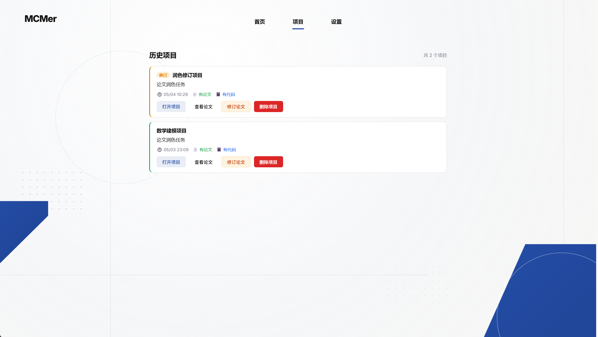
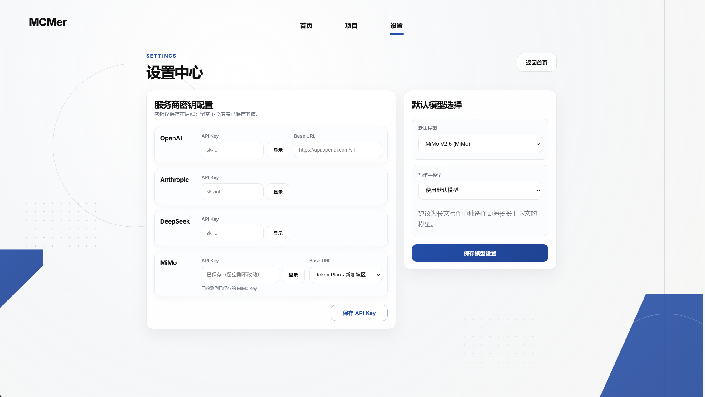

# MCMer

MCMer 是一个面向数学建模场景的多 Agent 全栈系统，支持从题目输入、数据上传、建模求解、结果复核、论文生成到历史项目回看的完整链路。

本项目在工程实现上参照了 [MathModelAgent](https://github.com/jihe520/MathModelAgent)。

## 项目预览

 
当前项目按两条主链路运行：

1. 写作功能
   适合从原题和数据出发，自动完成题目拆解、建模、审查、算法求解、数值复核、图表生成、成文与最终审查。
2. 论文润色
   适合对已有论文做一致性审查、数据复核、图文核对和竞赛风格修订。

 

1. 打开项目
   可以进入历史项目，重新审核其工作流。
2. 修订论文
   针对已经完成的论文，重新提交修改观点，让agent重新审视问题并修订论文。

 

1. 配置api key
   配置各主流模型服务商提供的key。 
2. 选择模型
   选择agent使用的模型。

---

## 后端规划

后端当前已经包含这些关键约束：

- 求解阶段限制只能使用当前环境已安装的库。
- 代码手必须输出结构化结果文件，不能只给自然语言总结。
- 写作链路已加入数值复核与更严格的最终审查。
- DOCX 导出支持公式与本地图片兜底嵌入。

## 工作流模式与数值结果保障

写作任务支持三种工作流模式：

- `fast`：优先速度，适合快速产出可用模型方案和核心计算流程；正文保持短稿，只保留必要公式、主要结果和风险提示。
- `standard`：默认模式，在完整性、速度和篇幅之间取中庸；会按 `solve_spec.subproblems` 拆分算法求解，每个子问题独立预算并立即落盘结构化结果。
- `strict`：严格体现在数值精度、单位一致性、公式口径、复核和证据链上，而不是生成更长的文字；正文会压缩套话，把篇幅留给可复核表格、误差说明和阻断说明。

算法求解阶段会优先生成 `result_registry.json`。其中 `summary` 会记录：

- `verified_count` / `blocked_count`：可写入论文的已验证结果数与阻断项数。
- `coverage_status`：`ready`、`partial` 或 `no_verified_results`。
- `coverage_ratio`：有 verified 结果的结构化结果文件占比。
- `top_blocked_reasons`：主要阻断原因，常见为工具调用次数、执行时间或缺少可复核数据。

当代码手接近工具调用上限时，会进入“最小数值交付模式”：优先把已算出的关键数值表、参数表、来源文件和未完成原因写入结构化结果文件，避免整篇论文因为某个子问题被阻断而完全缺少数值。

自动保全的中间结果不会直接等同于 `verified`。例如模型若采用 `T = K * P * d`，系统会检查 `K` 是否按 `T / (P * d)` 计算；若发现把 `P / T` 这类斜率误标为扭矩系数，会在结果注册表中阻断该项，等待重新求解或复核。

## 技术栈

- 前端：Vue 3、TypeScript、Vite、pnpm
- 后端：FastAPI、WebSocket、Redis、LiteLLM
- 代码执行：Jupyter Kernel 本地解释器
- 导出：Markdown、DOCX、Notebook

## 目录结构

```text
MCMer/
├─ backend/
│  ├─ app/
│  ├─ project/
│  ├─ pyproject.toml
│  └─ runtime_config.example.json
├─ frontend/
│  ├─ src/
│  └─ package.json
├─ .venv/
├─ start-dev.cmd
└─ README.md
```

---

## 快速启动

### 首次配置（git clone 之后）

如果你是刚通过 `git clone` 拉取本项目，建议按下面顺序完成第一次配置。

#### 1. 创建 Python 虚拟环境

本项目默认使用项目根目录下的 `.venv`，`start-dev.cmd` 也依赖这个约定。

```powershell
git clone <your-repo-url>
cd MCMer

py -3.11 -m venv .venv
.\.venv\Scripts\Activate.ps1

python -m pip install --upgrade pip
pip install -e .\backend
```

说明：

- 后端要求 Python >= 3.10，建议直接使用 Python 3.11。
- 使用 `pip install -e .\backend` 后，会按 [backend/pyproject.toml](backend/pyproject.toml) 安装后端依赖。
- 后端依赖量级属于中等，不算特别夸张，但会比普通 Web 项目稍重，因为包含 Jupyter/ipykernel、LiteLLM、文档导出等能力。

#### 2. 安装前端依赖

```powershell
cd frontend
pnpm install
cd ..
```

说明：

- 需要本机已安装 Node.js 和 `pnpm`。
- 前端依赖量级不大，主要是 Vue 3、Vite、Pinia、KaTeX、marked 等常规依赖。

#### 3. 复制环境配置文件

后端默认读取 `backend/.env.dev`，而不是直接读取 `.env.example`。因此 clone 后建议先复制一份：

```powershell
Copy-Item .\backend\.env.example .\backend\.env.dev
```

前端如果需要单独指定后端地址，也可以复制：

```powershell
Copy-Item .\frontend\.env.example .\frontend\.env.development
```

至少建议检查这些配置项：

- `OPENAI_API_KEY` / `DEEPSEEK_API_KEY` / `ANTHROPIC_API_KEY` / `MIMO_API_KEY`
- `DEFAULT_MODEL`、`MODELER_MODEL`、`CODER_MODEL`、`WRITER_MODEL`
- `CODE_INTERPRETER`，默认是 `local`
- `REDIS_URL`，默认是 `redis://localhost:6379/0`

补充说明：

- Redis 不是强制前置。若本机没有 Redis，后端会自动退回内存模式，项目仍可启动。
- 运行时模型和 key 也可以在前端设置页中修改，本地配置会写入 `backend/.local/runtime_config.json`。

### 方式一：一键启动

Windows 下可直接双击根目录脚本：

```bat
start-dev.cmd
```

这个脚本会：

- 启动后端 `uvicorn app.main:app --port 8000`
- 启动前端 `pnpm run dev --port 5173`
- 若前端尚未安装依赖，会先自动执行 `pnpm install`

启动后可访问：

- 前端首页：`http://127.0.0.1:5173`
- 后端接口文档：`http://127.0.0.1:8000/docs`

### 方式二：手动启动

#### 1. 后端

```powershell
cd backend
..\.venv\Scripts\python.exe -m uvicorn app.main:app --host 0.0.0.0 --port 8000
```

#### 2. 前端

```powershell
cd frontend
pnpm install
pnpm run dev --host 0.0.0.0 --port 5173
```

### 方式三：Docker Compose 启动

Docker 在本项目中的定位是可复现部署的第二启动方式，不替代你本地 `.venv + pnpm` 的开发方式。

#### 1. 准备配置文件

后端建议先复制一份开发环境配置：

```powershell
Copy-Item .\backend\.env.example .\backend\.env.dev
```

如果希望预先放入运行时模型与 key 配置，也可以初始化本地运行时配置目录：

```powershell
New-Item -ItemType Directory -Force .\backend\.local | Out-Null
Copy-Item .\backend\runtime_config.example.json .\backend\.local\runtime_config.json
```

说明：

- Compose 会把 `backend/project/work_dir`、`backend/.local` 和 `backend/logs` 挂载到容器内，方便保留任务产物、运行时配置和日志。
- Compose 内部会自动把后端 Redis 地址改为 `redis://redis:6379/0`，不需要手动改 `.env.dev`。

#### 2. 一键启动

```powershell
docker compose up --build
```

启动后可访问：

- 前端首页：`http://127.0.0.1:5173`
- 后端接口文档：`http://127.0.0.1:8000/docs`
- 后端健康检查：`http://127.0.0.1:8000/health`

#### 3. 停止与清理

```powershell
docker compose down
```

如果要连同 Redis 持久化数据一起删除：

```powershell
docker compose down -v
```

#### 4. Docker 方式的适用范围

- 适合复现 Redis、FastAPI、Vite 前后端联动和导出链路。
- 不建议替代本地开发调试；日常开发仍建议优先使用 `.venv` 和 `pnpm run dev`。

## 运行前准备

### Python

- 建议直接使用项目根目录下的 `.venv`
- 推荐 Python 3.11
- 后端依赖定义在 [backend/pyproject.toml](backend/pyproject.toml)

### Node.js

- 需要本地已安装 `pnpm`
- 建议 Node.js 18+
- 前端依赖定义在 [frontend/package.json](frontend/package.json)

### 配置文件

- 后端环境示例见 [backend/.env.example](backend/.env.example)
- 前端环境示例见 [frontend/.env.example](frontend/.env.example)
- 运行时模型与 key 配置模板见 [backend/runtime_config.example.json](backend/runtime_config.example.json)

实际运行时：

- 本地运行时配置会写入 `backend/.local/runtime_config.json`
- 不要提交真实密钥到仓库

## 使用流程

### 写作功能

1. 进入首页，选择“写作功能”
2. 输入题目或上传原题文档、数据文件
3. 等待任务依次经过分析、建模、求解、复核、写作与最终审查
4. 在项目页查看过程消息、论文、Notebook 与导出文件

### 论文润色

1. 进入首页，选择“论文润色”
2. 上传 Markdown、DOCX、PDF 或 zip 论文源文件
3. 等待系统执行一致性检查、数据复核、图文核对与措辞修订
4. 在项目页查看修订结果

## 构建与检查

### 前端构建

```powershell
cd frontend
pnpm run build
```

### 后端语法编译

```powershell
cd backend
..\.venv\Scripts\python.exe -m compileall app
```

## 产物说明

每个任务都会在 `backend/project/work_dir/<task_id>/` 下生成运行产物，通常包括：

- `res.md`：论文 Markdown
- `res.docx`：导出的 Word 文档
- `res.json`：任务结果摘要
- `notebook.ipynb`：代码执行记录
- `*_structured_results.json`：结构化中间结果
- 图表、CSV、JSON 等分析文件

## 免责声明

本项目 MCMer 仅用于数学建模学习、科研参考与教学演示，旨在为使用者提供题目分析思路、流程演示、建模方法参考与论文写作范式示例。

项目在输入题目与数据后生成的论文、图表、代码和相关结果，仅可作为学习材料，用于帮助使用者理解建模原理、梳理解题流程和学习学术表达规范，不构成可直接提交、可直接发表或可直接用于正式评审的成果。

严禁任何个人或团体将本项目输出内容直接或间接用于以下正式场景：

- 数学建模竞赛提交
- 课程作业提交
- 学术论文发表
- 学位论文或科研成果申报
- 其他要求原创性、独立完成或真实研究贡献的正式用途

**若使用者违反上述约定，擅自将本项目输出内容用于违规用途，由此产生的一切后果，包括但不限于竞赛成绩取消、课程成绩处理、学术处分、论文撤稿或其他责任，均由使用者自行承担，与本项目作者及贡献者无关，作者与贡献者不承担任何直接或间接责任。**

同时，禁止利用本项目从事有偿代做、内容倒卖、包装投稿、虚假申报或其他违规盈利行为。一经发现，项目作者有权在适用范围内保留追究相关责任的权利。

## 许可证

本项目使用 GPL-3.0-only，完整文本见 [LICENSE](LICENSE)。
