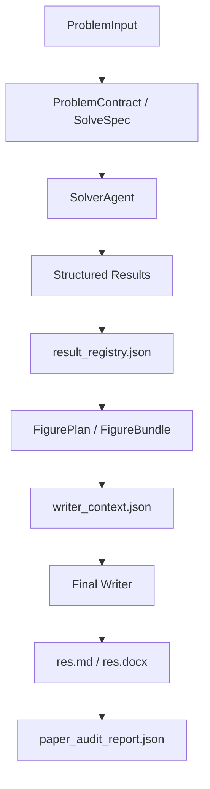
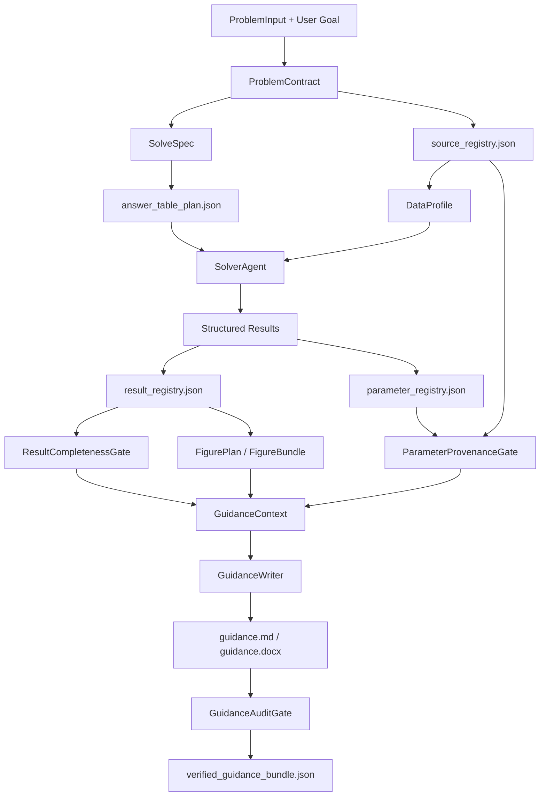

# 高可信建模指导方案长线计划

## 1. Go / No-Go

- **结论**：Go。
- **原因**：当前系统已经具备结构化结果、结果注册表、图表门禁、WriterContext、终审审计和导出能力，足以支撑从“直接产出论文”转向“产出高可信建模指导方案”。这个方向不是推倒重来，而是把系统重心从成文表达转到证据链、参数来源、计算复核和可执行指导。
- **关键判断**：高可信指导方案不能只是换一个 Writer prompt。它必须变成新的交付协议：所有建议、参数、图表、结论和风险说明都必须有来源、有状态、有复核路径。

## 2. 目标结果

项目长期目标调整为：

```text
输入题目、数据、约束和用户目标
  -> 产出一份可执行、可审查、可复现的建模指导方案
  -> 附带必要计算结果、参数表、参数来源、数据处理记录、图表、代码和审计报告
  -> 明确区分 verified / partial / blocked / assumed / user_required_confirmation
```

最终用户拿到的不是“看起来像论文的成品”，而是一份能指导人类完成高质量建模论文或建模报告的方案包。方案必须回答：

1. 这个问题应该如何建模。
2. 为什么选择这些模型，而不是其它模型。
3. 每个参数来自哪里，是否可复核。
4. 哪些结果已经算出，哪些结果只是方案建议。
5. 哪些结论有数据支持，哪些结论必须人工确认。
6. 如果继续写论文，应如何使用这些结果和图表。

## 3. 目标定义

- **类型**：产品方向调整 + 技术架构重锚 + 质量体系升级。
- **包含范围**：
  - 新增“建模指导方案”作为主交付物。
  - 保留已有论文输出能力，但降级为可选导出或后续使用场景。
  - 强化参数来源、结果复核、证据绑定、阻断披露和方案质量评分。
  - 调整后端 prompt、artifact schema、workflow stage、前端文案和导出命名。
  - 建立端到端 fixture，验证可信度而不是只验证文件存在。
- **不包含范围**：
  - 不承诺自动产出可直接提交的竞赛论文。
  - 不承诺所有题型都能自动求出完整最终数值。
  - 不把人类确认、题设歧义、外部资料引用伪装成 verified。
  - 不把模型建议、经验判断和真实计算结果混在同一个可信等级里。
- **延期事项**：
  - 多用户协同批注。
  - 在线资料自动检索与引用校验。
  - 面向具体竞赛格式的最终论文模板库。
  - 外部数据库级参数来源管理。
- **验证规则**：一份指导方案只有在其所有核心表格、参数、图表和结论都能回指 artifact，并通过门禁检查后，才能标记为 high_trust_guidance_ready。
- **证据来源**：`result_registry.json`、`parameter_registry.json`、`source_registry.json`、`answer_table_plan.json`、`guidance_context.json`、`guidance_audit_report.json`、导出的 Markdown/DOCX/Notebook/CSV。
- **通过标准**：
  - 所有具体数值结论都有 `result_id`。
  - 所有参数都有来源状态。
  - 所有图表都有 source data 和 linked result ids。
  - 所有 blocked 项都在最终方案中显式披露。
  - 方案正文没有引用未授权图片、未登记数值或虚构来源。
  - 至少 3 类真实题型 fixture 能稳定跑出可审计方案包。
- **置信说明**：可信度来自机器可检查的证据链，而不是 Writer 的语言质量。Writer 只能组织证据，不能创造证据。

## 4. 当前状态

当前项目已经存在的有利基础：

- `result_registry.json` 已作为结果可信性的核心注册表。
- 求解阶段已经要求结构化结果文件，而不是只输出自然语言总结。
- `writer_context.json` 已经开始约束 Writer 可引用的图片和结果。
- 图表阶段已经有 `figure_plan`、`figure_artifacts`、`figure_bundle`、图表语言检查和正文可用性检查。
- 终审阶段已经要求 `paper_audit_report.json`，并阻断无证据结论、数值不一致和图文不一致。
- `strict` 模式已经体现“数值精度、单位一致性、证据链优先”的方向。

当前主要不匹配：

- 系统命名和产品心智仍围绕“论文写作 / 论文润色 / PaperView”。
- `final_writer` 的目标仍是“完整论文 Markdown”，而不是“建模指导方案包”。
- 参数表和参数来源不是一等 artifact，更多依赖题目拆解和 Writer 表述。
- 结果完整性检查关注论文可写性，不够关注“指导方案是否可信”。
- blocked / partial 信息虽然存在，但最终展示还容易被成文表达弱化。
- 方案质量没有独立评分维度，如参数覆盖、来源覆盖、可复核性、人工确认项密度。

## 5. 新交付物定义

### 5.1 主交付物

默认主交付物从 `res.md` 的“论文正文”重定义为：

```text
guidance.md
```

建议兼容期内仍可写出 `res.md`，但其语义应调整为“当前主文档”。长期应采用：

```text
guidance.md
guidance.docx
guidance_summary.json
notebook.ipynb
result_registry.json
parameter_registry.json
source_registry.json
answer_table_plan.json
guidance_context.json
guidance_audit_report.json
verified_guidance_bundle.json
```

### 5.2 指导方案正文结构

`guidance.md` 应采用稳定结构：

1. 方案可信度摘要
   - 整体状态：ready / partial / blocked。
   - verified 结果数、blocked 结果数、待人工确认项数。
   - 最高风险项。
2. 问题理解与建模目标
   - 题目任务拆解。
   - 决策目标、约束、输入输出。
   - 题设锁定参数和不可擅改条件。
3. 数据与来源说明
   - 输入文件清单。
   - 字段解释。
   - 数据质量问题。
   - 预处理动作。
4. 参数总表
   - 参数符号。
   - 含义。
   - 单位。
   - 取值。
   - 来源类型。
   - 来源文件或题设位置。
   - 是否估计。
   - 估计方法。
   - 可信状态。
5. 模型选择方案
   - 候选模型。
   - 推荐模型。
   - 推荐理由。
   - 不采用模型的原因。
   - 简化假设与影响。
6. 分问题建模步骤
   - 每个子问题的输入、方法、公式、参数、计算步骤和输出。
   - 每一步是否已经计算完成。
7. 必要计算结果
   - verified 结果表。
   - partial 结果表。
   - blocked 结果表。
   - 每个结果对应 `result_id`。
8. 图表与解释
   - 只引用 `figure_bundle.available_figures`。
   - 图表必须绑定 source data 和 result ids。
9. 复核与稳健性
   - 数值复算。
   - 单位一致性。
   - 残差、敏感性、置信区间或收敛性检查。
   - 无法复核的原因。
10. 写作转化建议
   - 如果用户继续写论文，哪些内容可直接进入论文。
   - 哪些内容只能作为思路。
   - 哪些内容必须人工补算或确认。
11. 附录与可复现路径
   - 代码文件。
   - 数据产物。
   - JSON 注册表。
   - 图表产物。

## 6. 可信度等级协议

高可信方案必须把所有内容分层。建议统一引入 `trust_status`：

| 状态 | 含义 | 可否进入最终指导方案 | 可否作为论文结论 |
| --- | --- | --- | --- |
| `verified` | 已计算、已登记、已复核，来源完整 | 可以 | 可以，但仍需按论文语境改写 |
| `recalculated` | 已由独立复算确认 | 可以 | 可以 |
| `source_locked` | 来自题设或用户上传文件，不能擅改 | 可以 | 可以 |
| `estimated` | 由模型估计得到，方法和误差已说明 | 可以 | 谨慎使用 |
| `assumed` | 建模假设或经验设定，暂无直接数据来源 | 可以，但必须标注 | 不可作为确定结论 |
| `partial` | 有部分结果，但覆盖不足 | 可以，但必须披露 | 不建议作为主结论 |
| `blocked` | 未完成、不可复核或证据不足 | 必须披露 | 不可作为结论 |
| `user_required_confirmation` | 需要用户补充资料或确认 | 可以列为待确认 | 不可作为结论 |

写作规则：

- 任何带具体数值的句子必须绑定 `result_id` 或 `parameter_id`。
- 任何模型建议必须绑定 `rationale_id`。
- 任何来源说法必须绑定 `source_id`。
- 任何图表解释必须绑定 `figure_id` 和 `linked_result_ids`。
- Writer 不允许把 `assumed`、`partial`、`blocked` 写成确定结论。

## 7. 新 Artifact 协议

### 7.1 `parameter_registry.json`

参数来源是高可信指导方案的核心。建议新增：

```json
{
  "parameters": [
    {
      "id": "param_alpha",
      "symbol": "alpha",
      "name": "增长率系数",
      "meaning": "描述变量随时间变化的增长强度",
      "unit": "1/day",
      "value": 0.12,
      "value_type": "estimated",
      "source_type": "estimated_from_data",
      "source_ref": "data/q1_fit.csv",
      "source_location": "columns: t,y",
      "estimation_method": "least_squares",
      "linked_result_ids": ["result_q1_fit"],
      "confidence": "medium",
      "trust_status": "estimated",
      "notes": "95% CI should be included when available"
    }
  ],
  "summary": {
    "total_count": 1,
    "verified_count": 0,
    "estimated_count": 1,
    "assumed_count": 0,
    "blocked_count": 0
  }
}
```

### 7.2 `source_registry.json`

统一管理数据、题设、上传文件和人工输入：

```json
{
  "sources": [
    {
      "id": "source_problem_text",
      "type": "problem_statement",
      "path": "input/problem.md",
      "description": "原始赛题文本",
      "locked": true,
      "trust_status": "source_locked"
    },
    {
      "id": "source_data_q1",
      "type": "uploaded_data",
      "path": "data/q1.csv",
      "description": "用户上传的第一问数据表",
      "schema_summary": {"rows": 120, "columns": ["t", "y"]},
      "quality_flags": [],
      "trust_status": "source_locked"
    }
  ]
}
```

### 7.3 `answer_table_plan.json`

指导方案必须先知道题目要求回答什么，再判断结果是否足够：

```json
{
  "slots": [
    {
      "id": "answer_q1_final_value",
      "subproblem_id": "Q1",
      "required_output": "最终预测值",
      "expected_format": "number_with_unit",
      "required": true,
      "filled_by_result_id": "result_q1_prediction",
      "status": "verified"
    }
  ]
}
```

### 7.4 `guidance_context.json`

替代论文语境下的 `writer_context.json`，成为指导方案 Writer 的唯一输入：

```json
{
  "result_registry": "...compact verified/blocked results...",
  "parameter_registry": "...parameters and provenance...",
  "source_registry": "...source files and source locks...",
  "answer_table_plan": "...required answer slots...",
  "figure_bundle": "...available figures only...",
  "rules": {
    "no_unregistered_numbers": true,
    "must_disclose_blocked_items": true,
    "must_label_assumptions": true,
    "must_include_parameter_table": true
  }
}
```

### 7.5 `guidance_audit_report.json`

替代或扩展 `paper_audit_report.json`：

```json
{
  "status": "partial",
  "scores": {
    "result_coverage": 0.72,
    "parameter_provenance": 0.86,
    "source_traceability": 0.9,
    "recalculation_strength": 0.68,
    "blocked_disclosure": 1.0,
    "guidance_actionability": 0.82
  },
  "blocks": [
    {
      "type": "missing_parameter_source",
      "location": "参数表: beta",
      "route": "solver",
      "severity": "high",
      "fix": "补充 beta 的估计方法、来源数据列和置信区间"
    }
  ],
  "warnings": []
}
```

## 8. 架构目标

### 8.1 当前链路



### 8.2 目标链路



核心边界：

- Solver 负责产生候选数值、参数估计和结构化数据。
- Registry 层负责把产物规范化成可信证据。
- Gate 层负责阻断或降级不可信内容。
- GuidanceWriter 只负责组织方案，不负责创造证据。
- Final Bundle 只发布通过审计的内容。

## 9. 长线阶段计划

### 阶段 1：目标重锚与兼容命名

- **目的**：先让系统目标从“论文成文”稳定转为“指导方案交付”，避免后续改动仍被旧命名牵引。
- **入口条件**：确认主交付物是指导方案，论文作为可选派生产物。
- **阶段规则**：
  - 不大改求解逻辑。
  - 保留旧文件名兼容。
  - 所有用户可见文案必须避免暗示“可直接提交论文”。
- **任务**：
  - 将产品文案中的“论文写作”调整为“建模指导方案”或“方案生成”。
  - 将 `PaperView` 的展示语义调整为“方案查看”，内部组件名可延后迁移。
  - 将 ChatView 阶段文案从“论文组织”改为“方案组织”。
  - 在 README 中更新定位，明确不直接产出可提交论文。
  - 在后端任务结果里增加 `primary_artifact_type = guidance`。
- **验证**：
  - 前端启动后不再把主流程称为“论文成稿”。
  - 历史任务仍能打开旧 `res.md`。
  - 新任务结果能显示为指导方案。
- **停止条件**：
  - 如果用户仍要求默认导出论文，则必须先确定“双模式”产品策略。

### 阶段 2：指导方案 Writer 协议

- **目的**：把 Writer 从论文作者改成证据组织者。
- **入口条件**：阶段 1 的用户心智和主产物命名已经确定。
- **阶段规则**：
  - Writer 不能扫描工作目录找图或找数据。
  - Writer 不能新增未登记数字。
  - Writer 不能把 blocked/partial 改写为确定结论。
- **任务**：
  - 新增 `writing.guidance_writer` prompt。
  - 将 `final_writer` 保留为可选论文导出 prompt。
  - 在 workflow 中引入 `guidance_context`，初期可由现有 `writer_context` 扩展得到。
  - 修改最终生成提示：输出完整建模指导方案 Markdown，而不是完整论文 Markdown。
  - 在输出正文中强制包含参数表、结果覆盖表、阻断披露表。
- **验证**：
  - 构造一个含 blocked result 的任务，最终方案必须披露 blocked 项。
  - 构造一个没有 verified result 的任务，最终方案不得输出确定数值结论。
  - 最终正文中的数值能在 `result_registry.json` 找到来源。
- **停止条件**：
  - 如果 Writer 仍会虚构参数来源，必须先做阶段 3 的 registry。

### 阶段 3：参数来源注册表

- **目的**：让参数来源成为一等 artifact，而不是正文里的自然语言。
- **入口条件**：Solver 已能输出结构化结果文件。
- **阶段规则**：
  - 所有参数必须有 `trust_status`。
  - 没有来源的参数只能是 `assumed` 或 `blocked`。
  - 题设给定参数必须标记 `source_locked`。
- **任务**：
  - 定义 `parameter_registry.json` schema。
  - 从 `solve_spec`、题设拆解、结构化结果和数据文件中汇总参数。
  - 新增 `ParameterRegistryBuilder`。
  - 新增 `ParameterProvenanceGate`。
  - 在 guidance 正文中生成参数总表。
  - 在 audit 中检查参数表是否覆盖所有公式参数。
- **验证**：
  - 每个公式中的符号都能在参数表中找到。
  - 每个 estimated 参数都有 linked result 或 estimation method。
  - 每个 assumed 参数都在方案正文中显式标注。
- **停止条件**：
  - 如果公式符号抽取不稳定，先做最小规则：只检查 Solver 显式声明的参数。

### 阶段 4：答案槽位与结果完整性门禁

- **目的**：防止“方案写得很完整，但题目要求的答案没给”。
- **入口条件**：`result_registry` 和基础参数表可用。
- **阶段规则**：
  - 题目要求的每个输出必须变成 answer slot。
  - 每个 required slot 必须是 verified、partial 或 blocked，不能消失。
  - 完整性不足时，不允许标记 high trust ready。
- **任务**：
  - 新增 `answer_table_plan.json`。
  - 新增 `AnswerTablePlannerSkill`。
  - 新增 `ResultCompletenessGate`。
  - 在方案正文中输出“题目要求回答项覆盖表”。
  - 将 `coverage_status` 从结果数量覆盖升级为答案槽位覆盖。
- **验证**：
  - 对题目中明确要求“填表/求某值/给出排序”的任务，系统必须生成 answer slots。
  - 缺少最终答案时，方案状态必须是 partial 或 blocked。
  - 用户能一眼看到哪些问题已经可写入论文，哪些还不能。
- **停止条件**：
  - 如果题目解析无法稳定抽取答案槽位，先支持人工/LLM 抽取 + gate 校验。

### 阶段 5：来源注册与数据剖面

- **目的**：让所有输入和数据处理动作可追踪。
- **入口条件**：source ingest 已能保存上传文件。
- **阶段规则**：
  - 用户上传文件、题设文本、派生数据和人工配置必须分开标记。
  - 派生数据必须记录生成步骤。
  - Writer 不允许声称数据来源于不存在的文件。
- **任务**：
  - 新增 `source_registry.json`。
  - 新增 `data_profile.json` 或扩展现有数据剖面能力。
  - 记录每个结构化结果使用了哪些 source。
  - 在参数注册表中引用 source id，而不是只写路径字符串。
  - 在审计报告中检查 source 引用是否存在。
- **验证**：
  - 删除一个 source 文件后，audit 能发现引用断裂。
  - 派生 CSV 能回指原始输入和生成步骤。
  - guidance 正文中的“数据来源”表与 registry 一致。
- **停止条件**：
  - 如果旧任务没有 source registry，兼容层必须生成 legacy source summary。

### 阶段 6：复算、稳健性与可信评分

- **目的**：把“高可信”从口号变成可评分、可阻断的质量维度。
- **入口条件**：结果、参数、来源和答案槽位已有 registry。
- **阶段规则**：
  - 不同 `result_type` 使用不同复核要求。
  - 不能复核的结果必须降级。
  - 评分必须解释，不允许只有数字。
- **任务**：
  - 新增 `ValidationPlanSkill`。
  - 回归模型要求残差、显著性、参数置信区间或拟合优度。
  - 优化模型要求可行性、目标函数值、约束违反量、敏感性或收敛记录。
  - 分类模型要求混淆矩阵、指标、测试集或交叉验证说明。
  - 描述统计要求样本量、缺失率、异常值处理。
  - 新增 `guidance_audit_report.json` scores。
  - 新增 high trust 判定：最低分、硬阻断项、人工确认项数量。
- **验证**：
  - 没有复核记录的关键数值不得进入 high trust。
  - 复核失败必须路由回 solver 或降级披露。
  - audit report 能解释每个分数为什么得到。
- **停止条件**：
  - 如果某类题暂时无法自动复核，必须定义该题型的最低披露标准。

### 阶段 7：图表可信链路升级

- **目的**：确保方案中的图不是装饰，而是可追踪证据或可解释结构图。
- **入口条件**：现有 FigureBundle 可用。
- **阶段规则**：
  - 结果图必须绑定 verified result。
  - 结构示意图可以不绑定数值结果，但必须标记 `explanatory`，不能承载数值结论。
  - 诊断图不得混入正文图。
- **任务**：
  - 扩展 `visualization_contract`，区分 `evidence_figure`、`explanatory_figure`、`diagnostic_figure`。
  - GuidanceWriter 根据图类型放入不同章节。
  - `FigureSemanticGate` 检查图注是否夸大图表含义。
  - guidance audit 检查图表引用和正文解释是否一致。
- **验证**：
  - 未绑定结果的图不能被描述为“证明了某数值结论”。
  - debug 图不会进入 guidance。
  - 每张正文图都能在 `figure_bundle` 找到。
- **停止条件**：
  - 如果语义 gate 误杀过多，先收紧到硬规则：路径白名单、result id、source data。

### 阶段 8：最终方案包与导出

- **目的**：形成稳定可交付的方案包。
- **入口条件**：guidance audit 可运行。
- **阶段规则**：
  - 导出包必须包含正文和全部证据 artifact。
  - DOCX 与 Markdown 引用的图片必须一致。
  - 不通过 audit 的包不能标记 verified。
- **任务**：
  - 新增 `verified_guidance_bundle.json`。
  - 将导出器从 paper 语义扩展为 guidance 语义。
  - 导出 Markdown、DOCX、Notebook、CSV/JSON 附件清单。
  - 前端结果页展示可信评分、阻断项、附件列表。
  - 历史项目页支持旧任务和新任务两种 artifact。
- **验证**：
  - Markdown 和 DOCX 图片一致。
  - bundle 中列出的文件都存在。
  - 前端能展示 guidance status 和 audit blocks。
- **停止条件**：
  - 如果 DOCX 导出与 Markdown 语义不一致，先以 Markdown + artifact zip 作为可信交付。

### 阶段 9：真实题型回归集

- **目的**：用真实题型证明可信度，而不是只证明代码路径能跑通。
- **入口条件**：主链路能生成 guidance bundle。
- **阶段规则**：
  - fixture 评估标准是证据链完整性，不是文字漂亮。
  - 每类题至少有一个成功、一个 partial、一个 blocked 场景。
- **任务**：
  - 建立物理机理题 fixture。
  - 建立统计回归题 fixture。
  - 建立优化决策题 fixture。
  - 建立只有题目无数据的 blocked fixture。
  - 建立缺参数来源 fixture。
  - 建立图文不一致 fixture。
  - 建立旧任务兼容 fixture。
- **验证**：
  - 每次改动可运行回归测试。
  - 每个 fixture 检查 registry、guidance、audit、bundle。
  - high trust 状态只在证据完整时出现。
- **停止条件**：
  - 如果端到端测试成本太高，先建立 artifact-level fixture，再补完整 WebSocket 流程。

### 阶段 10：论文派生能力

- **目的**：在可信方案基础上，再可选生成论文，而不是让论文倒逼证据。
- **入口条件**：guidance bundle 已可信。
- **阶段规则**：
  - 论文 Writer 只能读取 verified guidance bundle。
  - 论文中的确定数值只能来自 high trust 或 verified 项。
  - 论文必须保留必要局限，不得删除方案中的 blocked 披露。
- **任务**：
  - 新增 `paper_from_guidance_writer`。
  - 从 guidance 提取论文骨架。
  - 把参数表、结果表、图表转为论文附录或正文。
  - 将原 `paper_audit_report` 转为论文派生审计。
- **验证**：
  - 同一个 guidance bundle 可稳定派生论文草稿。
  - 派生论文不能新增 guidance 中不存在的结果。
  - 论文 audit 与 guidance audit 不冲突。
- **停止条件**：
  - 如果派生论文弱化可信披露，默认关闭论文导出。

## 10. 关键设计决策

### 10.1 为什么不是继续优化论文 Writer

继续优化论文 Writer 可以短期改善观感，但不能解决可信度根因。可信度问题不是措辞问题，而是来源、参数、结果、图表和审计之间没有足够硬的协议。只改 Writer 会让风险隐藏得更深。

### 10.2 为什么不是直接删除论文功能

论文功能仍有价值，但它应该变成可信方案的下游派生物。直接删除会浪费已有导出、图文一致性、终审审计和润色链路。更好的方式是改变主线，保留派生。

### 10.3 为什么参数表必须独立

数学建模方案的可信度很大程度取决于参数。参数若只出现在正文里，就无法被机器检查，也无法判断是题设给定、数据估计、经验假设还是模型选择。独立 registry 能把参数从“文字”提升为“证据对象”。

### 10.4 为什么 blocked 项必须进入最终方案

高可信不是保证全部完成，而是保证不伪装完成。blocked 项进入最终方案，反而提升可信度：用户知道哪里不能直接用、下一步该补什么。

### 10.5 为什么评分不能只有总分

一个 85 分方案可能是结果强但参数来源弱，也可能是参数完整但复算不足。必须拆成 result coverage、parameter provenance、source traceability、recalculation strength、blocked disclosure、actionability 等维度。

## 11. 质量门禁

### 11.1 GuidanceReadyGate

检查：

- 是否存在 `guidance.md`。
- 是否存在 `guidance_context.json`。
- 是否存在 `guidance_audit_report.json`。
- 是否存在 `result_registry.json`。
- 是否存在参数表或明确说明无参数。
- 是否披露所有 blocked 项。

阻断：

- 方案正文包含未登记数值。
- 方案正文包含未登记参数来源。
- required answer slot 消失。
- blocked 项没有披露。

### 11.2 ParameterProvenanceGate

检查：

- 参数是否有唯一 id。
- 参数是否有单位或单位缺失说明。
- 参数是否有 source type。
- estimated 参数是否有方法。
- assumed 参数是否有假设说明。

阻断：

- 公式核心参数没有参数表记录。
- 参数有具体值但无来源。
- 题设锁定参数被修改。

### 11.3 ResultCompletenessGate

检查：

- 每个子问题是否有 answer slots。
- required slots 是否被填充。
- 填充结果是否 verified。
- partial/blocked 是否有原因。

阻断：

- 题目明确要求的最终输出没有状态。
- 只有模型框架，没有结果覆盖说明。

### 11.4 SourceTraceabilityGate

检查：

- 所有 source id 是否存在。
- 数据文件路径是否存在。
- 派生数据是否记录生成来源。
- 图表 source data 是否可追踪。

阻断：

- 引用不存在文件。
- 声称来自题设但无法定位。
- 结果使用了未知数据源。

### 11.5 GuidanceSemanticGate

检查：

- Writer 是否把 partial 写成 verified。
- Writer 是否夸大图表含义。
- Writer 是否把建议写成结论。
- Writer 是否删除风险披露。

阻断：

- 明显无证据结论。
- 关键风险被隐藏。
- 方案建议与 registry 状态冲突。

## 12. 测试策略

### 12.1 单元测试

- `ParameterRegistryBuilder`：参数合并、来源状态、重复 id。
- `AnswerTablePlanner`：槽位抽取、required/optional 标记。
- `GuidanceContextBuilder`：只暴露允许 Writer 使用的内容。
- `GuidanceAuditGate`：未登记数值、缺来源、blocked 未披露。

### 12.2 Artifact 测试

每个 fixture 至少检查：

- `result_registry.json` schema。
- `parameter_registry.json` schema。
- `source_registry.json` schema。
- `answer_table_plan.json` schema。
- `guidance_context.json` 不包含 forbidden images。
- `guidance.md` 包含参数表、结果表、阻断披露。
- `guidance_audit_report.json` 状态符合预期。

### 12.3 端到端测试

高价值场景：

- 有完整数据的回归题，预期 high trust 或 ready。
- 有缺失参数的物理题，预期 partial。
- 无法求解的优化题，预期 blocked 但给出可执行方案。
- 旧历史任务，预期兼容打开。
- 含非法图表引用的任务，预期 audit 阻断。

### 12.4 人工审查清单

每次大版本至少人工抽查：

- 参数来源是否读起来可信。
- 阻断项是否足够醒目。
- 方案是否真的能指导下一步建模。
- Writer 是否有“语言很顺但证据不足”的倾向。
- 前端是否误导用户认为可以直接提交。

## 13. 前端调整计划

### 第一轮：文案重锚

- “写作功能”改为“方案生成”。
- “论文润色”保留，但说明其是已有文档审查/修订。
- “开始写作”改为“生成方案”。
- “论文组织”改为“方案组织”。
- “查看论文”改为“查看方案”。

### 第二轮：结果页可信度展示

新增展示：

- overall status。
- result coverage。
- parameter provenance。
- blocked items。
- required answer slots。
- artifact list。

### 第三轮：历史任务兼容

- 旧任务显示“论文结果”。
- 新任务显示“指导方案”。
- 若只有 `res.md`，兼容读取。
- 若有 `guidance.md`，优先读取。

## 14. 后端调整计划

### 第一轮：Prompt 和产物名

- 新增 guidance writer prompt。
- 修改 workflow 最终阶段提示。
- 新增 guidance artifact path。
- 保留 `res.md` 兼容写入。

### 第二轮：Registry

- 新增 parameter registry。
- 新增 source registry。
- 新增 answer table plan。
- 扩展 result registry summary。

### 第三轮：Gate

- 新增 ParameterProvenanceGate。
- 新增 ResultCompletenessGate。
- 新增 GuidanceAuditGate。
- 扩展 FigureSemanticGate。

### 第四轮：Bundle

- 新增 verified guidance bundle。
- 扩展 exporters。
- 前端 API 返回 guidance metadata。

## 15. 迁移策略

### 15.1 兼容期

兼容期内同时支持：

```text
res.md
res.docx
paper_audit_report.json
```

和：

```text
guidance.md
guidance.docx
guidance_audit_report.json
```

读取优先级：

```text
guidance.md > res.md
guidance.docx > res.docx
guidance_audit_report.json > paper_audit_report.json
```

### 15.2 命名迁移

代码内部可以分批迁移：

1. 先改用户可见文案。
2. 再加 guidance artifact。
3. 再迁移变量名和组件名。
4. 最后清理 paper-only 命名。

### 15.3 旧任务处理

旧任务没有参数注册表时：

- 生成 `legacy_parameter_summary`。
- 状态不得标记 high trust。
- 前端显示“旧任务，可信度评分不可用”。

## 16. 风险与防御

### 风险 1：方案更可信，但用户觉得“不够像成品”

- **防御**：在正文末尾提供“论文转化建议”，说明哪些内容可以进入论文。
- **残余风险**：追求自动成稿的用户可能流失。

### 风险 2：参数来源要求过严导致大量 blocked

- **防御**：引入 `assumed` 和 `user_required_confirmation`，允许方案继续交付，但禁止伪装。
- **残余风险**：早期输出看起来更保守。

### 风险 3：Registry 过多增加维护复杂度

- **防御**：先用 builder 聚合，避免各阶段直接写多个 registry。
- **残余风险**：schema 初期会调整频繁。

### 风险 4：Writer 仍绕过规则

- **防御**：GuidanceAuditGate 做机器检查；未登记数值、未披露 blocked、非法图片引用一律阻断。
- **残余风险**：语义夸大需要逐步增强检测。

### 风险 5：端到端回归成本过高

- **防御**：先做 artifact-level fixture，再补全 WebSocket E2E。
- **残余风险**：早期无法完全覆盖 UI 行为。

## 17. 优先级建议

最高优先级：

1. Guidance Writer 协议。
2. 参数来源注册表。
3. 答案槽位和结果完整性门禁。
4. Guidance Audit Gate。

次高优先级：

1. 前端文案重锚。
2. Source Registry。
3. 可信评分。
4. Guidance Bundle。

后置：

1. 论文派生 Writer。
2. 深度语义图文审计。
3. 在线来源检索。
4. 完整组件重命名。

## 18. 最小可执行版本

如果只做一个 1-2 周版本，建议范围是：

1. 新增 `guidance_writer` prompt。
2. 最终输出改为 `guidance.md`，同时兼容写 `res.md`。
3. 强制包含：
   - 参数表。
   - 结果覆盖表。
   - blocked 项披露表。
   - 论文转化建议。
4. 从现有 `result_registry` 和 `writer_context` 生成简化版 `guidance_context.json`。
5. 新增简化版 `guidance_audit_report.json`：
   - 检查未登记数值。
   - 检查 blocked 是否披露。
   - 检查图片引用是否在白名单。
6. 前端主文案从“论文写作”改为“方案生成”。

这个版本不会解决所有参数来源问题，但能立刻把方向扳正，并让后续 registry 工作有落点。

## 19. 最终验收标准

当以下条件满足时，可以认为“高可信建模指导方案”方向完成第一阶段产品化：

- 新任务默认产出 `guidance.md`。
- 所有结果页默认展示指导方案，而不是论文。
- 参数表覆盖所有核心模型参数。
- 每个参数有来源状态。
- 每个题目 required answer slot 有状态。
- 每个具体结果有 `result_id`。
- 每个图表有 source data 和 linked result ids。
- blocked/partial 项在正文和 audit 中同时出现。
- `guidance_audit_report.json` 能给出状态、评分和阻断原因。
- 至少 3 类题型 fixture 通过。
- 旧任务仍能打开，不破坏历史项目。

## 20. 第一执行步

建议下一步直接做一个小而硬的 vertical slice：

```text
guidance_writer prompt
  + guidance.md 输出
  + 简化 guidance_context.json
  + 简化 guidance_audit_report.json
  + 前端文案改为方案生成
```

这一刀能最快验证新方向是否成立，同时不会过早陷入完整 schema 设计。只要这条 slice 跑通，就可以进入参数来源和答案槽位的深水区。
